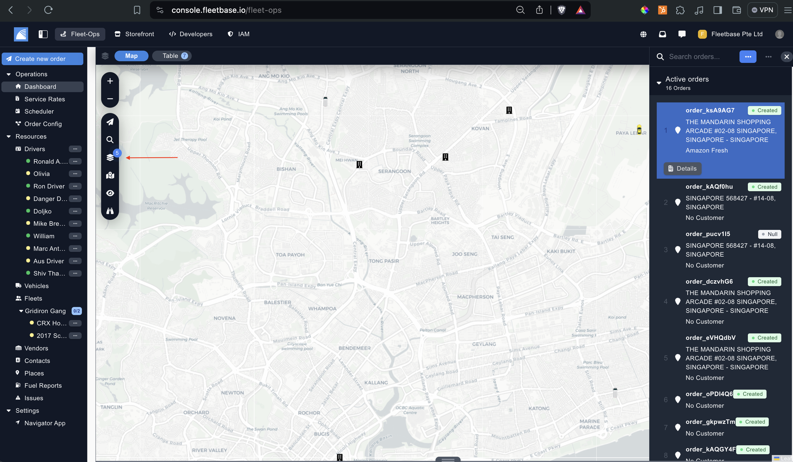

## Overview

In order to create and track orders within Fleetbase, your order config and resources need to be actioned. You can view the step up process by seeing our 'Get Started' guide. 

### View Orders

1. View Orders from the dashboard. 

2. View Orders from the table view. 

### Create Order

You can create orders multiple ways in Fleetbase. 

- Manual Order Creation.
- Click ‘Import’ to bulk import orders using our excel template. 
- Create orders directions through our API - view our API Documentation here.

Input order details: 

1. **Order Type** - Select the order config that you have created, this will pull in the custom fields you have created and will follow the activity statuses that are created too. 
2. **Internal ID** - Set the internal ID for this order.
3. **Schedule** - This is the date and time this order will be dispatched, if you select 'Adhoc' the order will be pinged to all drivers in this radius.
4. **Customer** - Select the customer that is assigned to this order. 
5. **Facilitator** - You can assign afaciliattor to this order. A facilitator can be a 3rd party contractor or transport company that will be facilitate the transport of this order. 
6. **Assign Driver** - Assign a driver to this order, this driver will be able to view the order on the Navigator App once the order has been created. 
7. **Assign Vehicles** - Assign the vehicle to this order. 
8. **Proof of Delivery** - Select the proof of delivery method for this order. 
9. **Adhoc** - If you select adhov, then this order will be pinged to all drivers in a given radius. You can set the raidus, this is from the first pick up location.
10. **Dispatch Immediately** - If you select this, then the order will be dispatched immediatley and the driver can start to update the activity status. 
11. **Multiple Dropoff's** - If this order has multiple drop offs, then you can toggle this. To send an optimized route to ther drivers, click the 'Optimize Route' button. 

12. **Payload** - This is the payload that you are delivering. You can create custom entities in the order config. 
13. **Apply Service Rate** - If you toggle this, you can then select and apply a service rate that you have created previously. 
14. **Notes** - Add any notes to the order. 
15. **Documents & Files** - Upload any documents or files to this order. 
16. **Metadata** - Edit any of the meta data for the order.

#### Updating Orders

Each order that has been created will have a series of activity status updates that need to be actioned before the order is completed.

The activities that are available for completion will be the same as the order configuration selected. There are two ways to update the status of a job to completion.

Update the order till the completed or last status.

1. You can update the status of the job by viewing the job on the FleetOps web app
2. The driver can update from the Fleetbase Navigator App.

### Completed Orders

Once the order has been you can view the activity time stamps and the order details on the order details.

### Exporting Orders

Export orders by selecting the orders and then clicking the 'Export' button. 

#### Cant find what you are looking for? [Raise a request](https://github.com/fleetbase/docs/issues) or join our [Community](https://discord.gg/HnTqQ6zAVn) ✌️ 